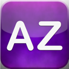

iVerb
=====

[iVerb](http://www.lisacintosh.com/iverb/) for iOS (iPhone and iPad) contains all irregular english verbs, for a total of 348 verbs, with simple past, past participle and definition, plus an help to remind all tenses. 

Compiled with Xcode 5.1 for iOS 7

The code source and resources are under MIT licence.

[Lisacintosh](http://www.lisacintosh.com/), 2014

[AppStore Link](https://itunes.apple.com/us/app/iverb/id320891276?ls=1&mt=8)